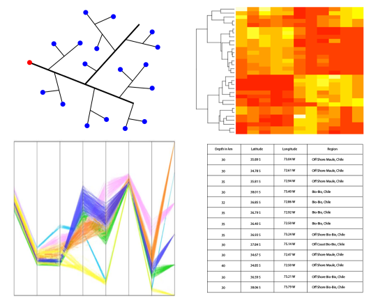

## Propositions de stages 2017

L'analyse de données est un point clé dans l'interprétation des résultats dans le domaine de la recherche tout comme celui du Big Data. L'interprétation n'est pas une fin en soit, mais une étape qui permet de générer de nouvelles hypothèses. Pour cela, les sorties graphiques ne doivent pas être figées, mais au contraire proposer à l'analyste des outils pour interagir.

La cytométrie de flux est une méthode de caractérisation des cellules en biologie grâce l'étude de différentes molécules à la surface. Les avancées technologiques permettent d'étudier des dizaines de molécules de surface sur une même cellule qui mène à une complexité importante. La quantité de données ainsi accumulées est importante aussi car un tel instrument analyse plusieurs centaines de milliers de cellules en une dizaine de minutes. Des outils de calcul sont proposés à l'expérimentateur pour lui permettre d'interpréter de telles données. Cependant, ces outils proposent le plus souvent que des sorties graphiques figées qui manquent cruellement d'interactivité. L'expérimentateur a donc du mal à intégrer et interpréter ces résultats avec sa connaissance d'expert.

### Visualisations interactives en JavaScript

Le stage consiste à évaluer la librairie d3js afin de représenter des données dans différentes représentations : graphe (ou réseau), heatmaps, coordonnées parallèles, nuages de points en 2D, table. Les informations pour représenter les données sont pré-calculées. L'objectif est de réaliser une représentation telle que dans la figure ci-dessous. Cette représentation devra être permettre à l'utilisateur de sélectionner des données dans l'une des représentations et de mettre en avant les données séelctionnées dans les autres représentations. En fonction des possibilités de cette librairie, d'autres pourront être ajoutées. L'objectif est aussi d'ajouter dans une colonne un nom à cette sélection de données. A terme ces outils seront intégrés dans une chaîne d'analyse via [Galaxy](https://galaxyproject.org/).

### Extension d'une application Shiny d'automatisation de tests statistiques

Lorsque les tableaux de données comportent plusieurs dizaines de variables (colonnes) à comparer et à corréler, les comparaisons 2 à 2 deviennent fastidieuses. Ainsi l'utilisation d'un logiciel classique n'est pas du tout pratique. De façon à automatiser cette tâche, nous avons créé une interface Shiny qui effectue toutes les comparaisons 2 à 2 des variables en s'adaptant à la nature de chaque variable. Il manque actuellement 2 points importants et des extensions intéressantes :
- gérer l'appariement des données (un même individu est mesuré plusieurs fois au cours du temps par exemple). Il faudra donc appliquer les bons tests en introduisant la colonne qui indiquera l'individu. On pourra éventuellement proposer un modèle mixte pour résoudre la question des valeurs manquantes.
- présenter des graphiques pour interpréter le résultat de chaque : un nuage de points pour une corrélation des 2 variables quantitatives, un boxplot pour comparer une variable quantitative au sein de plusieurs groupes...
- effectuer une ACP des variables quantitatives

### Extension du logiciel MeV d'analyse de données en Java

MeV est un logiciel Java qui permet d'analyser des matrices de données. L'objectif est d'ajouter des méthodes d'analyses de données supervisées telles que Linear Discriminant Analysis, Partial Least Squarre, d'intégrer la réduction de dimensions tSNE et de proposer une version compilée pour Macintosh.

